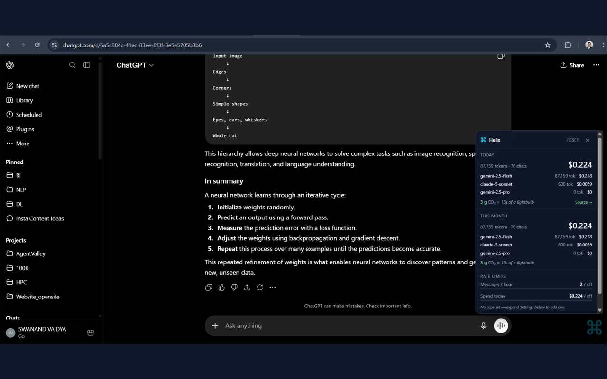
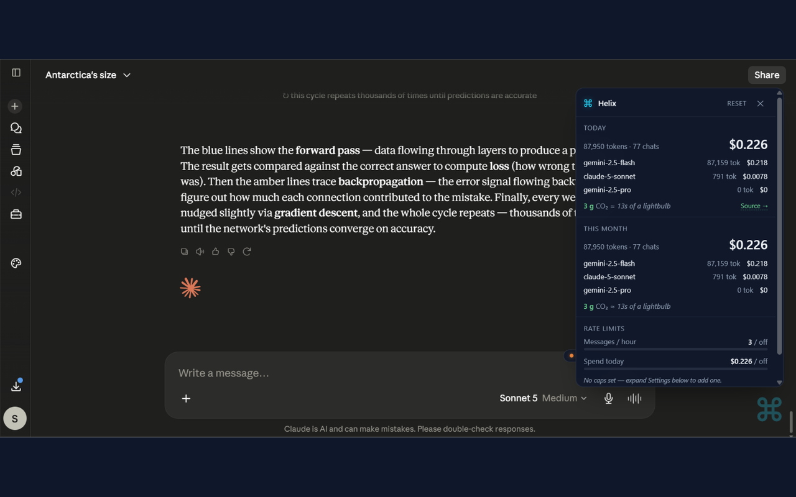
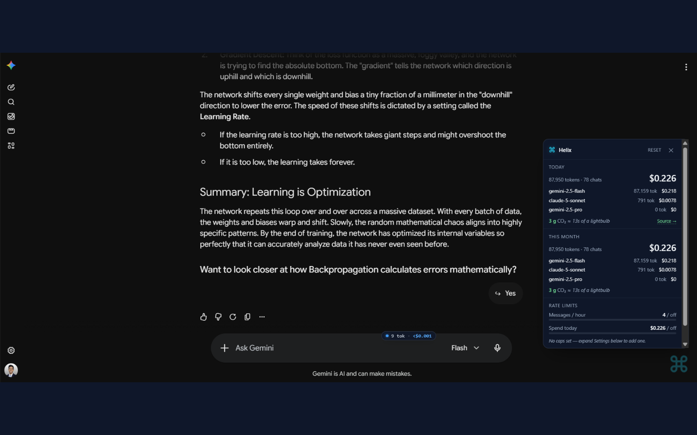

# Helix

**A live token + cost meter for ChatGPT, Claude, and Gemini.**
Install the browser extension, chat like normal, and see exactly how much every message is costing you — in tokens, dollars, and grams of CO₂. Local-only, no accounts, no cloud.

<p align="center">
  
</p>

<p align="center">
  <a href="https://chromewebstore.google.com/detail/helix-llm-token-meter"></a>
  <a href="LICENSE"></a>
  <a href="https://github.com/Swanand66/helix"></a>
</p>

---

## ⚡ Install (30 seconds)

**[→ Install from the Chrome Web Store](https://chromewebstore.google.com/detail/helix-llm-token-meter)**

_(replace the link above with your live listing URL once your Chrome Web Store submission is approved)_

Works on Chrome and Edge. Firefox port coming soon.

Prefer a developer install (load-unpacked)? See [Developer install](#developer-install) below.

---

## What you get

- **A quiet ⌘ orb** in the bottom-right of chatgpt.com, claude.ai, gemini.google.com, and aistudio.google.com
- **Per-provider glow** — green while ChatGPT streams, orange for Claude, rainbow for Gemini
- **Live cost preview** — before you send, a badge above the input shows `342 tok · $0.001` for your current prompt
- **Click the orb** → panel with today's + this month's usage broken down by model
- **CO₂ estimate** for every chat, with a link to the peer-reviewed paper it's calibrated against
- **Self-imposed rate limits** — set a max messages per hour or max dollars per day; orb turns amber/red as you approach the cap
- **Ctrl+Shift+H** (Cmd+Shift+H on Mac) toggles the orb on/off per tab
- **Daily-refreshed pricing** — providers change rates, you get them within 24h without re-installing
- **Fully local** — no accounts, no telemetry, prompts never leave your browser

## Screenshots

<p align="center">
  
</p>

<p align="center">
  
</p>

<p align="center">
  
</p>

## Developer install

Prefer to run from source (or want to modify it)?

1. Clone this repo
2. Open `chrome://extensions/` in Chrome or Edge
3. Toggle **Developer mode** on (top-right)
4. Click **Load unpacked** → select the `apps/extension/` folder
5. Pin the Helix icon to your toolbar

## How it works (30-second version)

```
   Your chat on chatgpt.com / claude.ai / gemini.google.com
                ↓
   Extension's content script hooks window.fetch (and XHR on Gemini)
                ↓
   Sees the completion request → reads model + input
   Tees the streaming response → counts tokens as they arrive
                ↓
   Multiplies token counts by current per-1M rates + carbon factor
                ↓
   Stores compact entry in chrome.storage.local
   Fires a smooth glow animation on the ⌘ orb
                ↓
   You click the orb → panel shows today + month totals
```

**Every step is local.** The only network call the extension makes is a once-per-24-hour GET to a public JSON file for updated pricing.

## Repo layout

```
Helix/
├── apps/
│   └── extension/           the browser extension (currently v0.4.8)
│       ├── manifest.json    MV3 manifest
│       ├── background.js    service worker: tokenize + store + daily prices
│       ├── content.js       isolated-world relay
│       ├── page-hook.js     main-world fetch + XHR override + SSE stream parser
│       ├── orb-inject.js    shadow-DOM in-page ⌘ orb + panel
│       ├── preview-inject.js  live cost preview badge above the send input
│       ├── popup.html/js    toolbar popup
│       ├── tokenize.js      approximator + model normalizer + price/carbon math
│       └── icons/           16 / 48 / 128 PNGs
│
├── scripts/
│   ├── build-icons.mjs      regenerate icon PNGs from the ⌘ SVG
│   ├── package.mjs          build the Chrome Web Store zip → dist/helix-vX.Y.Z.zip
│   └── fit-screenshot.mjs   resize any image to CWS's required 1280×800
│
├── screenshots/             1280×800 PNGs used in the store listing + README
│
├── prices.json              source-of-truth pricing table (mirrored to
│                            Swanand66/helix_price for daily refresh)
│
├── dist/                    generated zips (git-ignored)
│
├── CHROME_WEB_STORE_LISTING.md    copy-paste kit for store submissions
├── PRIVACY.md                     privacy policy (linked from the store)
├── DESKTOP_PLAN.md                plan for a Tauri desktop app + CLI/proxy
├── README.md                      you are here
└── LICENSE                        MIT
```

## Related repo

**[Swanand66/helix_price](https://github.com/Swanand66/helix_price)** — the daily-refreshable pricing table. A GitHub Action there scrapes LiteLLM's community-maintained pricing JSON once a day and commits diffs. The extension fetches this file to stay current without shipping new versions.

## Development

```bash
# Regenerate icons after editing scripts/build-icons.mjs
node scripts/build-icons.mjs

# Build the Chrome Web Store zip
node scripts/package.mjs
# → dist/helix-v0.4.8.zip

# Resize screenshots to CWS's 1280×800 spec
node scripts/fit-screenshot.mjs my-raw-screenshot.png

# Load-unpacked the apps/extension/ folder in chrome://extensions/
# and reload it after any code change.
```

## Roadmap (shipped)

- [x] v0.1 — Extension for ChatGPT + Claude with in-page glowing ⌘ orb
- [x] v0.1 — Daily auto-refresh of pricing via GitHub Action
- [x] v0.2 — Per-source colors (green / orange / blue) + live cost preview badge
- [x] v0.3 — CO₂ estimate + user-set rate limits
- [x] v0.3 — Ctrl+Shift+H shortcut to hide/show the orb
- [x] v0.4 — Gemini + AI Studio support with rainbow brand-color glow
- [x] v0.4 — Cross-provider refresh dedup (no double-counting on page reload)
- [x] v0.4 — Shipped to Chrome Web Store 🎉

---

## 🔮 Future scope

Ideas we want to build next. Roughly ordered by how much they'd change the daily experience.

### 1. Copy context across models (the killer next feature)

One click on the orb → **"Copy this thread to Claude / to Gemini"**. Extension reads the current chat, condenses history into a portable prompt, opens the target site in a new tab, and prefills the input.

Why it matters: today, switching models mid-thread means manually copy-pasting the entire conversation. Helix already sees the full chat — it should be able to move it.

### 2. Cross-model prompt comparison

Type a prompt once → send it to GPT-5, Claude Sonnet, and Gemini Pro simultaneously in three panes. Compare answers + costs side-by-side. Winner gets the follow-up.

### 3. Prompt library

Save your best prompts as reusable snippets. Right-click any past prompt in the panel → **"Save as template"**. Then type `/name` in any chat input to expand.

### 4. Duplicate-question detection

Local semantic hash of your last 500 prompts. When you type something similar to a past prompt, the panel pops: *"You asked this 3 days ago — here's the answer, no need to spend again."*

### 5. Weekly wrap-up card

Every Sunday: an auto-generated shareable image showing your week — most-used model, total spent, longest chat, funny stat. Spotify Wrapped for AI. One-click share to X / LinkedIn.

### 6. Prompt quality grade

Real-time A–F grade next to the send button. Uses a tiny local classifier to spot vague / too-long / duplicate prompts and suggest fixes before you spend tokens on them.

### 7. Desktop app (Tauri)

A native menu-bar app + local proxy so we can also track:

- Claude Code CLI, Codex CLI, Aider, and any script using the OpenAI/Anthropic SDKs
- Cursor, VS Code with Cline / Continue
- Any tool that respects `OPENAI_BASE_URL` / `ANTHROPIC_BASE_URL`

Full plan in [`DESKTOP_PLAN.md`](DESKTOP_PLAN.md).

### 8. More providers

- **Perplexity** — via perplexity.ai
- **Microsoft Copilot Chat** — via copilot.microsoft.com
- **Poe.com** — aggregates many models in one place
- **Mistral / DeepSeek** direct chat interfaces
- **Local Ollama** — read `/api/tags` and log local model usage (cost = $0, useful for CO₂/latency)

### 9. Firefox + Safari ports

Same codebase, wrapped for Firefox Add-ons (free) and Safari Web Extension (needs an Apple Developer account for iOS support).

### 10. Team dashboards

Optional paid tier. Same events, but synced to a shared dashboard so a team can see collective AI spend + set org-wide budgets. Free forever for individuals.

### 11. AI-generated insights

Local LLM (WebLLM) reads your usage patterns and periodically tells you: *"You use Claude Opus 12x more for coding than for writing. Coding tasks average 800 tokens — you could switch to Haiku and save $18/mo with almost no quality loss."*

### 12. Export & tags

- Export usage as CSV / JSON for tax / expense purposes
- Manual project tagging: right-click any past event → **"Tag as: work / research / side-project"**
- Cost breakdowns per project

### 13. Voice + realtime API tracking

When ChatGPT Voice Mode and Claude's realtime API go mainstream, add audio-token tracking.

### 14. Native macOS / Windows menu-bar app

Not the same as the Tauri app in #7 — this is a compact always-visible dock/menu-bar meter that syncs with the browser extension. Great for people who want a persistent glance-view even when the browser isn't focused.

---

## Privacy

Nothing leaves your browser besides the daily price-file fetch. See [`PRIVACY.md`](PRIVACY.md) for the full policy — and the code is fully open source, so every claim is verifiable.

## Contributing

Issues, PRs, and feature ideas welcome — especially model additions, per-site parser fixes when providers change APIs, and translations of the panel.

## License

MIT — see [`LICENSE`](LICENSE).
